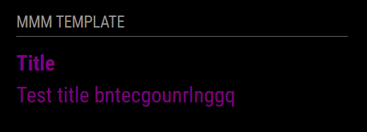

# MMM-PID

*MMM-PID* is a module for [MagicMirror²](https://github.com/MagicMirrorOrg/MagicMirror) that displays departure boards from stops integrated into the system [PID](https://pid.cz/) (Pražská integrovaná doprava) Prague public trasport. Using Golemio free API.


## Screenshot



## Installation

Just go to the modules directory and clone the repository and install the dependencies:

```bash
cd ~/MagicMirror/modules
git clone https://github.com/lucasbotka/MMM-PID.git
cd ~/MagicMirror/modules/MMM-PID
npm install
```

### Update

Just go to the MM-PID directory and pull the update and install the dependencies:

```bash
cd ~/MagicMirror/modules/MMM-PID
git pull
npm ci --omit=dev
```

## Configuration

*MMM-PID* using Golemio [API](https://api.golemio.cz/docs/openapi/). You can request your key for free [here](https://api.golemio.cz/api-keys/auth/sign-in).

To use this module, you have to add a configuration object to the modules array in the `config/config.js` file.

In order to display departure boards for specific stops, you need to find their ID [here](https://pid.cz/en/opendata/)  in the section (PID stop list) in the XML or JSON file.

### Example configuration

Minimal configuration to use the module:

```js
Module.register("MMM-PID", {
  defaults: {
    apiKey: "YOUR_GOLEMIO_API_KEY",
    stops: [
      {
        aswIds: '1973_2',
        allowed_routes: [], //filter routes which you want to show 
        maxDepartures: 5 //number of departures to show
      }
    ],
    minutesAfter: 160, // how many minutes in advance will departures be displayed
    updateInterval: 60000 // 1 minute
  },
```

Configuration with all options:

```js
    {
        module: 'MMM-Template',
        position: 'lower_third',
        config: {
            exampleContent: 'Welcome world'
        }
    },
```

### Configuration options

Option|Description
------|------|------|-----------
`exampleContent`|The content to show on the page


## Developer commands

- `npm install` - Install all dependencies.
- `node --run lint` - Run linting and formatter checks.
- `node --run lint:fix` - Fix linting and formatter issues.
- `node --run test` - Run linting and formatter checks + Run spelling check.
- `node --run test:spelling` - Run spelling check.


## Contributing

If you find any problems, bugs or have questions, please [open a GitHub issue](https://github.com/lucasbotka/MMM-PID/issues) in this repository.

Pull requests are of course also very welcome 🙂

## License

This project is licensed under the MIT License - see the [LICENSE](LICENSE.md) file for details.
