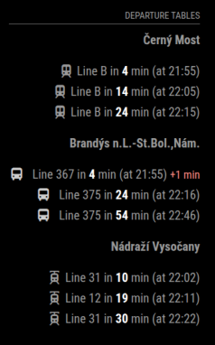

# MMM-PID

*MMM-PID* is a module for [MagicMirror²](https://github.com/MagicMirrorOrg/MagicMirror) that displays real-time departure boards for public transport stops within the [PID](https://pid.cz/) system. Using the free Golemio API, it shows departure times, including any current delays, for Prague and the surrounding region in the Czech Republic.


## Screenshot



## Installation

Go to the modules directory and clone the repository:

```bash
cd ~/MagicMirror/modules
git clone https://github.com/lucasbotka/MMM-PID.git
```

### Update

Go to the MMM-PID directory and pull the update:

```bash
cd ~/MagicMirror/modules/MMM-PID
git pull
```

## Configuration

*MMM-PID* uses the Golemio [API](https://api.golemio.cz/docs/openapi/). You can obtain your key for free [here](https://api.golemio.cz/api-keys/auth/sign-in).

To use this module, you have to add a configuration object to the modules array in the `config/config.js` file.

In order to display departure boards for specific stops, you need to find their ID [here](https://pid.cz/en/opendata/) in the PID stop list (XML or JSON file). To ensure you have the correct direction and platform, you can use this [map](https://pid.cz/zastavky-pid/).

### Example configuration


```js
{
			module: 'MMM-PID',
			position: 'top_right',
			header: "Departure board",
			config: {
				apiKey: "YOUR_GOLEMIO_API_KEY", 
				stops: [
					{
						aswIds: '897/101', //Černý most - Metro
						allowed_routes: [ ], 
						maxDepartures: 3
					},
					{
						aswIds: '1827_2', // Brandýs nad Labem náměstí
						allowed_routes: [ '367' , '375' ],
						maxDepartures: 3
					},
					{
						aswIds: '474/3', // Nádraží Vysočany
						allowed_routes: [ ],
						maxDepartures: 3
					}
				],
				minutesAfter: 160,
				updateInterval: 60000, // 1 min
				showIcons: true,
				showWheelchairIcon: false,
				showAirConditionedIcon: false
			}
		},
```
### Configuration options

Option|Description
------|-----------
`apiKey`| Your Golemio API [key](https://api.golemio.cz/api-keys/auth/sign-in)
`stops`| Array of stop objects (see below)
`minutesAfter`| How many minutes ahead departures should be fetched (default: `160`)
`updateInterval`| How often to refresh departures in milliseconds (default: `60000`)
`showIcons`| Show transport type icons (default: `true`)
`showWheelchairIcon`| Show wheelchair accessibility icon when available (default: `false`)
`showAirConditionedIcon`| Show air conditioning icon when available (default: `false`)

Each object in the `stops` array supports the following options:

Option|Description
------|-----------
`aswIds`| Stop ID from the PID stop list
`allowed_routes`| Only show these line numbers. Empty array means all lines. Eg. `[ '375', '367' ]`
`maxDepartures`| Maximum number of departures to display for this stop (default: `5`)

> **Note:** Canceled trips and vehicles currently standing at the stop are not displayed.


## Developer commands

- `npm install` - Install all dependencies.
- `node --run lint` - Run linting and formatter checks.
- `node --run lint:fix` - Fix linting and formatter issues.
- `node --run test` - Run linting and formatter checks.


## Contributing

If you find any problems, bugs or have questions, please [open a GitHub issue](https://github.com/lucasbotka/MMM-PID/issues) in this repository.

Pull requests are of course also very welcome 🙂

## License

This project is licensed under the MIT License - see the [LICENSE](LICENSE.md) file for details.
