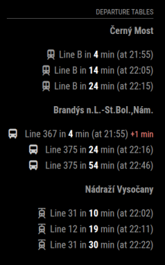

# MMM-PID

*MMM-PID* is a module for [MagicMirror²](https://github.com/MagicMirrorOrg/MagicMirror) that displays public transport departure boards from stops integrated into the [PID](https://pid.cz/) system - Prague integrated transport (CS Pražská integrovaná doprava) . Using Golemio free API.


## Screenshot



## Installation

Just go to the modules directory and clone the repository and install the dependencies:

```bash
cd ~/MagicMirror/modules
git clone https://github.com/lucasbotka/MMM-PID.git
cd ~/MagicMirror/modules/MMM-PID
npm ci --omit=dev
```

### Update

Just go to the MMM-PID directory and pull the update and install the dependencies:

```bash
cd ~/MagicMirror/modules/MMM-PID
git pull
npm ci --omit=dev
```

## Configuration

*MMM-PID* using Golemio [API](https://api.golemio.cz/docs/openapi/). You can obtain your key for free [here](https://api.golemio.cz/api-keys/auth/sign-in).

To use this module, you have to add a configuration object to the modules array in the `config/config.js` file.

In order to display departure boards for specific stops, you need to find their ID [here](https://pid.cz/en/opendata/)  in the section (PID stop list) in the XML or JSON file. To ensure you have correct direction and platform, you can use this [map](https://pid.cz/zastavky-pid/).

### Example configuration

Minimal configuration to use the module:

```js
{
			module: 'MMM-PID',
			position: 'top_right',
			header: "Departure board",
			config: {
				apiKey: "YOUR_GOLEMIO_API_KEY", 
				stops: [
					{
						aswIds: '897/101',
						allowed_routes: [ ], 
						maxDepartures: 3
					},
					{
						aswIds: '1827_2',
						allowed_routes: [ ],
						maxDepartures: 3
					},
					{
						aswIds: '474/3',
						allowed_routes: [ ],
						maxDepartures: 3
					}
				],
				minutesAfter: 160,
				updateInterval: 60000
			}
		},
```

Configuration with all options:

```js
{
			module: 'MMM-PID',
			position: 'top_right',
			header: "Departure board",
			config: {
				apiKey: "YOUR_GOLEMIO_API_KEY", 
				stops: [
					{
						aswIds: '897/101',
						allowed_routes: [ ], 
						maxDepartures: 3
					},
					{
						aswIds: '1827_2',
						allowed_routes: [ ],
						maxDepartures: 3
					},
					{
						aswIds: '474/3',
						allowed_routes: [ ],
						maxDepartures: 3
					}
				],
				minutesAfter: 160,
				updateInterval: 60000
			}
		},
```

### Configuration options

Option|Description
------|-----------
`apiKey`| Your golemio api [key](https://api.golemio.cz/api-keys/auth/sign-in)
`aswIds`| Stop ID
`allowed_routes`| Filter the lines to be displayed  Eg. [ '375' , '367' ]
`maxDepartures`| Limit the number of results displayed
`minutesAfter`| How many minutes in advance should departures be displayed
`minutesAfter`| How many minutes in advance should departures be displayed
`updateInterval`| How often should the output be updated in ms


## Developer commands

- `npm install` - Install all dependencies.
- `node --run lint` - Run linting and formatter checks.
- `node --run lint:fix` - Fix linting and formatter issues.
- `node --run test` - Run linting and formatter checks + Run spelling check.
- `node --run test:spelling` - Run spelling check.


## Contributing

If you find any problems, bugs or have questions, please [open a GitHub issue](https://github.com/lucasbotka/MMM-PID/issues) in this repository.

Pull requests are of course also very welcome 🙂

## License

This project is licensed under the MIT License - see the [LICENSE](LICENSE.md) file for details.
